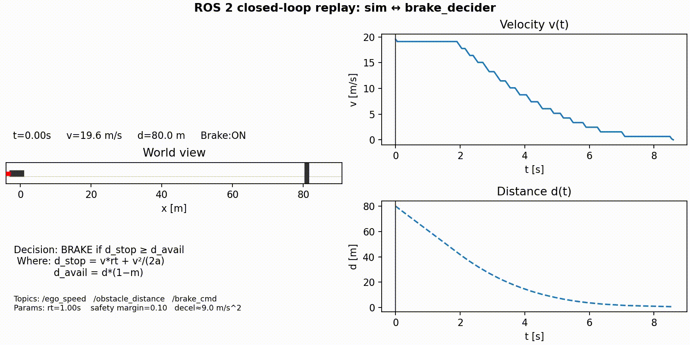

# ROS2_Brake_Validation_Sim - ROS 2 closed-loop 1D braking sim (Stage 3)

<table>
<tr>
<td>

## Project Context

This repo is **Stage 3** of a project during my [ADAS Learning Sprint](https://github.com/IvanMcCauley/Adas_Learning_Sprint):

1. **[Braking decision library (C++17)](https://github.com/IvanMcCauley/braking_decision_lib)** - standalone math + unit tests  
2. **[ROS 2 integration](https://github.com/IvanMcCauley/ros2_brake_decider/blob/main/README.md)** - parameterized node with pub/sub  
3. **1D longitudinal simulation (this repo)** - validate decisions in a simulation


</td>
<td width="300" valign="top">



</td>
</tr>
</table>

**Goal:** sanity-check that my ROS 2 brake decider’s `/brake_cmd` actually stops the car before an obstacle under simple 1D dynamics

---

## What this is
- Tiny **Python / rclpy** sim that:
  - **Subscribes**: `/brake_cmd` (`std_msgs/Bool`)
  - **Publishes**: `/ego_speed` (m/s), `/obstacle_distance` (m)
  - Integrates 1D motion at **dt = 0.05 s** and logs CSV: `t,x,v,d,brake_cmd,u`
- **Matplotlib** script that replays the CSV to a split-screen **MP4** (car vs wall + `v(t)` / `d(t)` + HUD)
- Keeps it honest: simple physics, expected ON/OFF chatter (no hysteresis yet)

---

## TL;DR - run it

**Terminal A - decider**
```bash
# working dir:
cd ~/ros2_ws
source /opt/ros/humble/setup.bash
source install/setup.bash
ros2 launch ros2_brake_decider brake_decider.launch.py
```
**Terminal B - sim**
```bash
# working dir:
cd ~/ros2_ws
source /opt/ros/humble/setup.bash
source install/setup.bash
ros2 run longitudinal_1d_sim sim_node
```
Wait for a line like:
<code>SUCCESS - stopped before obstacle at t=…; d=…; v=0.00 m/s. CSV: ~/ros2_ws/logs/longitudinal_sim_*.csv</code>

**Terminal C - render the video**
```bash
# deps (once):
sudo apt update && sudo apt install -y ffmpeg
python3 -m pip install --user matplotlib numpy

# working dir:
cd ~/ros2_ws/src/longitudinal_1d_sim
python3 scripts/make_video_anim.py
```
MP4 goes to: <code>~/ros2_ws/results/videos/.</code>

---

## ROS 2 I/O

**Subscribe**
- `/brake_cmd` - `std_msgs/Bool` (from Stage 2)

**Publish**
- `/ego_speed` - `std_msgs/Float64` (m/s)
- `/obstacle_distance` - `std_msgs/Float64` (m)

**Rate**
- 20 Hz (dt = 0.05 s)


### Topics & params (cheat-sheet)

|                | name             | default  |
|----------------|------------------|----------|
| decider param  | `reaction_time`  | 1.0 s    |
| decider param  | `decel`          | 9.0 m/s^2|
| decider param  | `safety_margin`  | 0.10     |
| sim internal   | `dt`             | 0.05 s   |

### Run without Stage 2 (manual toggle)

If you just want to see the sim move, you can publish `/brake_cmd` by hand:

```bash
# brake ON for 1 s, then OFF
ros2 topic pub /brake_cmd std_msgs/Bool '{data: true}' --once
sleep 1
ros2 topic pub /brake_cmd std_msgs/Bool '{data: false}' --once
```
(With Stage 2 running, **don’t** do this—let the decider drive it.)

---

## Dynamics (discrete)
State: position **x [m]**, velocity **v [m/s]**. Obstacle fixed at `x_obs; distance d = x_obs − x`.

Control **u [m/s^2]** from /brake_cmd:
- `u = 0` if `brake_cmd == false`
- `u = -decel` if `brake_cmd == true` (default decel ~ 9.0)

Update each tick:
```lua
v_{k+1} = max(0, v_k + u_k * dt)
x_{k+1} = x_k + v_k * dt
```
Logged CSV columns: `t, x, v, d, brake_cmd, u`.
  - Note: single-threshold logic in Stage 2 will chatter near the boundary.

---
## Visualization (CSV → MP4)
- Left: car vs wall with a red brake light when `/brake_cmd == true`.
- Right: `v(t)` and `d(t)` with a time cursor (replays the CSV; no mock data).
- HUD: `t, v, d, Brake: ON/off` and a small decision note.
- If MP4 fails, the script falls back to GIF.

**Why this matters:** it’s a **closed-loop** check. The sim consumes the **actual** /brake_cmd from Stage 2 and verifies a stop before the obstacle under simple physics.

---

## Repo layout (what matters
```
longitudinal_1d_sim/
├─ longitudinal_1d_sim/
│  └─ sim_node.py            # ROS 2 sim node (rclpy)
├─ scripts/
│  ├─ make_video.py          # quick static preview (PNG)
│  └─ make_video_anim.py     # CSV → split-screen MP4 replay
├─ package.xml
├─ setup.py / setup.cfg
└─ resource/…                 # standard ament_python bits
```
Runtime folders (created automatically):
```
~/ros2_ws/logs/            # CSV logs (t,x,v,d,brake_cmd,u)
~/ros2_ws/results/videos/  # MP4/GIF renders
```

---

## Install & Build
```bash
# working dir:
cd ~/ros2_ws/src
# (put this package here)

# build
cd ~/ros2_ws
colcon build --packages-select longitudinal_1d_sim --symlink-install

# source
source /opt/ros/humble/setup.bash
source ~/ros2_ws/install/setup.bash
```
Python libs:
```bash
python3 -m pip install --user matplotlib numpy
# or: sudo apt install python3-matplotlib
```

---

## “Why did it brake?” - decision rule (for context)

Stage 2 uses:
```ìni
d_react = v * reaction_time
d_brake = v^2 / (2 * decel)
d_stop  = d_react + d_brake
d_avail = obstacle_distance * (1 - safety_margin)
brake   = (d_stop >= d_avail)
```
The sim does **not** re-implement that rule; it only **consumes** `/brake_cmd` and applies physics to verify the stop.

---

## Debug / sanity checks
```bash
# working dir:
cd ~
source /opt/ros/humble/setup.bash
source ~/ros2_ws/install/setup.bash

# discovery
ros2 node list
ros2 node info /brake_decider
ros2 topic list | egrep 'ego_speed|obstacle_distance|brake_cmd'

# build only this package
cd ~/ros2_ws
colcon build --packages-select longitudinal_1d_sim --symlink-install

# newest CSV exists?
ls -t ~/ros2_ws/logs/longitudinal_sim_*.csv | head -n 1

# mp4 writer missing?
sudo apt install -y ffmpeg
```

Common gotchas:
- **No CSV:** the sim didn’t reach success or logs dir missing (script creates it).
- **First v ~ 19.6 m/s:** decider braked on the first 50 ms tick - expected.
- **Chatter in video:** single threshold = ON/OFF near the boundary by design for v0.1.

---

## What I learned (short)
- rclpy basics: subscribers, timers, logging, simple QoS.
- Matplotlib: figures vs axes, basic GridSpec, HUD placement with axis transforms, zorder (draw order), saving MP4 via ffmpeg.
- Why threshold-only logic chatters in discrete time (and simple fixes later: latch/hysteresis).

---

## License
MIT (see [License](https://github.com/IvanMcCauley/ros2_brake_validation_sim/blob/main/LICENSE)).
